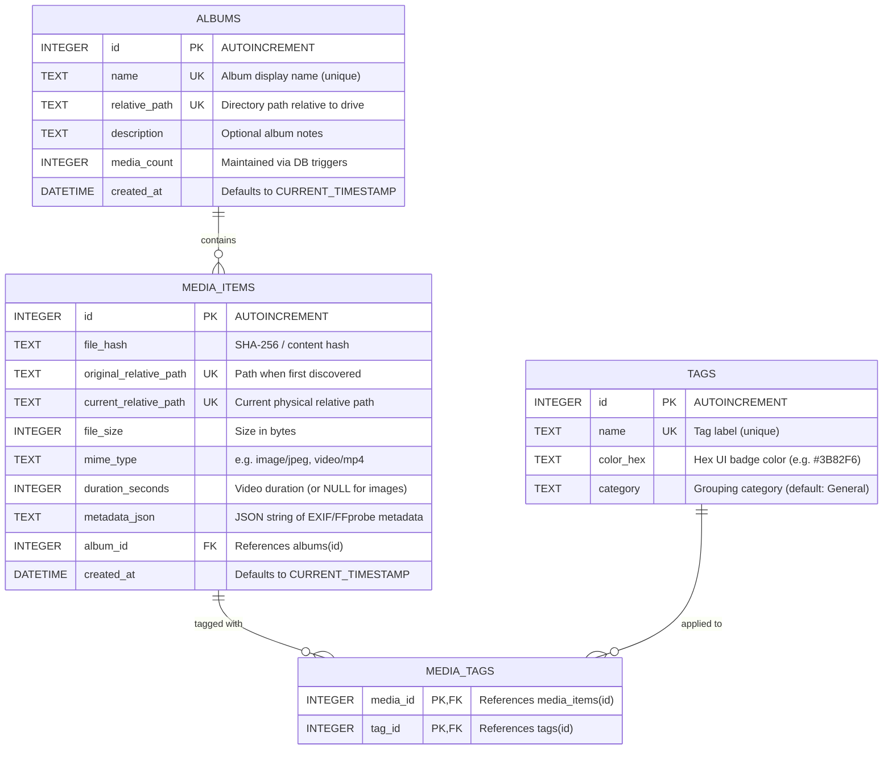

# Database Schema & Query Guide

This document provides a comprehensive reference for the SQLite database architecture, table definitions, triggers, indexes, and common query patterns used by the **External Drive Media Organizer**.

---

## 1. Storage Strategy & exFAT Optimization

The media library database is stored directly on the removable storage volume:
- **Primary Database Path**: `<drive_path>/albums/.media_library.db` (or fallback `<drive_path>/albums/media_library.db`)
- **Snapshot Backup Directory**: `<drive_path>/albums/.backups/media_library-<YYYY-MM-DDTHH-MM-SS>.db`
- **Thumbnail Cache Directory**: `<drive_path>/albums/thumbs/<file_hash>.jpg`

### Removable Drive Pragmas
To ensure data integrity on FAT32/exFAT drives (which lack POSIX advisory file locking and suffer from WAL corruption when unmounted abruptly), connections strictly apply:

| PRAGMA | Value | Rationale |
| :--- | :--- | :--- |
| `busy_timeout` | `5000` | Waits up to 5 seconds for locked operations before failing. |
| `journal_mode` | `DELETE` | Prevents stale `-wal` / `-shm` sidecar file corruptions across removable drives. |
| `synchronous` | `FULL` | Flushes all sector writes to physical flash media immediately. |

---

## 2. Entity Relationship Diagram (ERD)



---

## 3. Table Schema Definitions

### 3.1 `media_items`
Stores metadata and location tracking for all indexed images, photos, and video assets.

```sql
CREATE TABLE IF NOT EXISTS media_items (
    id INTEGER PRIMARY KEY AUTOINCREMENT,
    file_hash TEXT NOT NULL,
    original_relative_path TEXT UNIQUE NOT NULL,
    current_relative_path TEXT UNIQUE NOT NULL,
    file_size INTEGER NOT NULL,
    mime_type TEXT NOT NULL,
    duration_seconds INTEGER DEFAULT NULL,
    metadata_json TEXT,
    album_id INTEGER,
    created_at DATETIME DEFAULT CURRENT_TIMESTAMP
);
```

### 3.2 `albums`
Represents folder-based and virtual album collections.

```sql
CREATE TABLE IF NOT EXISTS albums (
    id INTEGER PRIMARY KEY AUTOINCREMENT,
    name TEXT UNIQUE NOT NULL,
    relative_path TEXT UNIQUE NOT NULL,
    description TEXT,
    media_count INTEGER DEFAULT 0,
    created_at DATETIME DEFAULT CURRENT_TIMESTAMP
);
```
> **Default Record**: An `unknown` album (`albums/unknown`) is seeded automatically on initialization to store unsorted media.

### 3.3 `tags`
User-defined taxonomy for classification and filtering.

```sql
CREATE TABLE IF NOT EXISTS tags (
    id INTEGER PRIMARY KEY AUTOINCREMENT,
    name TEXT UNIQUE NOT NULL,
    color_hex TEXT NOT NULL DEFAULT '#3B82F6',
    category TEXT DEFAULT 'General'
);
```

### 3.4 `media_tags`
Many-to-many junction table associating media items with tags.

```sql
CREATE TABLE IF NOT EXISTS media_tags (
    media_id INTEGER,
    tag_id INTEGER,
    PRIMARY KEY (media_id, tag_id)
);
```

---

## 4. Triggers & Automated Counters

The database automatically manages `albums.media_count` using three SQLite triggers, eliminating counter desynchronization:

```sql
-- Increment counter on new media insertion
CREATE TRIGGER IF NOT EXISTS after_media_insert
AFTER INSERT ON media_items
BEGIN
    UPDATE albums SET media_count = media_count + 1 WHERE id = NEW.album_id;
END;

-- Decrement counter on media deletion
CREATE TRIGGER IF NOT EXISTS after_media_delete
AFTER DELETE ON media_items
BEGIN
    UPDATE albums SET media_count = MAX(0, media_count - 1) WHERE id = OLD.album_id;
END;

-- Rebalance counts when media moves between albums
CREATE TRIGGER IF NOT EXISTS after_media_update
AFTER UPDATE OF album_id ON media_items
WHEN OLD.album_id != NEW.album_id
BEGIN
    UPDATE albums SET media_count = MAX(0, media_count - 1) WHERE id = OLD.album_id;
    UPDATE albums SET media_count = media_count + 1 WHERE id = NEW.album_id;
END;
```

---

## 5. Indexes

Optimized query paths for gallery pagination, date sorting, and media type filtering:

```sql
CREATE INDEX IF NOT EXISTS idx_media_album_created ON media_items(album_id, created_at);
CREATE INDEX IF NOT EXISTS idx_media_created       ON media_items(created_at);
CREATE INDEX IF NOT EXISTS idx_media_mime          ON media_items(mime_type);
```

---

## 6. Query Guide & Common Patterns

### 6.1 Gallery Pagination with Filtering

#### All Items (Newest First)
```sql
SELECT id, file_hash, current_relative_path, file_size, mime_type, duration_seconds, album_id, created_at
FROM media_items
ORDER BY created_at DESC
LIMIT :limit OFFSET :offset;
```

#### Filter by Media Type (Images or Videos)
```sql
-- Images only
SELECT * FROM media_items
WHERE mime_type LIKE 'image/%'
ORDER BY created_at DESC
LIMIT 24 OFFSET 0;

-- Videos only
SELECT * FROM media_items
WHERE mime_type LIKE 'video/%'
ORDER BY created_at DESC
LIMIT 24 OFFSET 0;
```

#### Filter by Specific Album
```sql
SELECT * FROM media_items
WHERE album_id = :album_id
ORDER BY created_at DESC
LIMIT :limit OFFSET :offset;
```

---

### 6.2 Album Management & Cover Thumbnail Resolution

#### Fetch All Albums with Dynamic Cover Thumbnail
```sql
SELECT 
    a.id, 
    a.name, 
    a.relative_path, 
    a.description, 
    a.media_count,
    (
        SELECT m.file_hash 
        FROM media_items m 
        WHERE m.album_id = a.id 
        ORDER BY m.created_at DESC 
        LIMIT 1
    ) AS cover_file_hash
FROM albums a
ORDER BY a.name ASC;
```

#### Move Media Items to Another Album
```sql
UPDATE media_items 
SET album_id = :target_album_id, 
    current_relative_path = :new_relative_path 
WHERE id = :media_id;
-- Triggers automatically rebalance both source and target album media_counts!
```

---

### 6.3 Tagging Operations

#### Fetch Tags for a Specific Media Item
```sql
SELECT t.id, t.name, t.color_hex, t.category
FROM tags t
INNER JOIN media_tags mt ON mt.tag_id = t.id
WHERE mt.media_id = :media_id
ORDER BY t.category, t.name;
```

#### Filter Media by Tag
```sql
SELECT m.* 
FROM media_items m
INNER JOIN media_tags mt ON mt.media_id = m.id
WHERE mt.tag_id = :tag_id
ORDER BY m.created_at DESC;
```

---

### 6.4 Library Analytics & Mobile Server Summary

```sql
SELECT 
    COUNT(*) AS total_items,
    SUM(CASE WHEN mime_type LIKE 'image/%' THEN 1 ELSE 0 END) AS total_images,
    SUM(CASE WHEN mime_type LIKE 'video/%' THEN 1 ELSE 0 END) AS total_videos,
    SUM(file_size) AS total_bytes,
    (SELECT COUNT(*) FROM albums) AS total_albums,
    (SELECT COUNT(*) FROM tags) AS total_tags
FROM media_items;
```

---

## 7. Automated Backups & Corruption Recovery

1. **Snapshot Generation**:
   The application creates immutable backup snapshots without database locks using SQLite's `VACUUM INTO` command:
   ```sql
   VACUUM INTO '<drive_path>/albums/.backups/media_library-2026-08-20T21-30-00.db';
   ```
2. **Rotation**: Retains the 5 most recent snapshots in `.backups/`, auto-pruning older snapshots.
3. **Automatic Recovery**: On startup, if corruption is detected (`malformed`, `corrupt`, `disk image malformed`), the engine automatically restores the latest verified backup from `.backups/` and rebuilds missing triggers/indexes.
